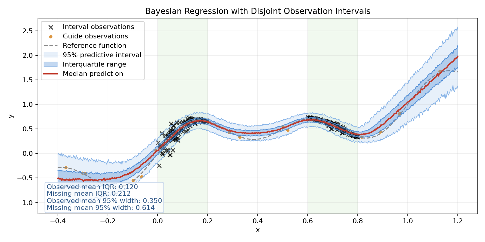
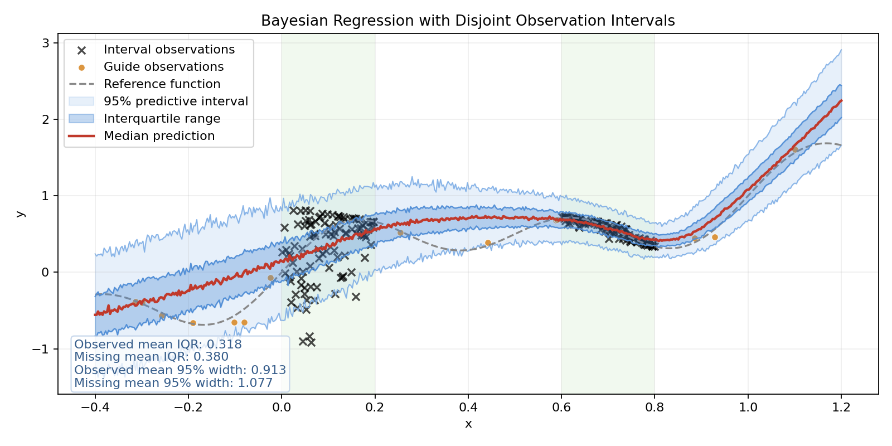

# Bayesian Methods for Neural Networks

This repository contains PyTorch Bayes-by-Backprop code for MNIST classification, synthetic regression, and an optional desktop digit-drawing demonstration. The accompanying course report, *Metodi Bayesiani per le Reti Neurali*, is credited to **Brunetto Daniele and Mattia Faini**, in that order, and is dated 12 May 2026. An [English PDF](bayesian_methods_en.pdf) is included.

## Report summary

The report introduces Bayesian model averaging as a way to represent uncertainty rather than relying on one fitted weight vector. It distinguishes uncertainty from data noise from uncertainty about the model, then develops Bayes by Backprop through a variational distribution over weights, the reparameterization trick, and a mixture prior. Its equations and four-step update procedure describe the approximation used to train Bayesian neural networks.

The second part discusses Monte Carlo Dropout as another approximate Bayesian method. The report compares it with Bayes by Backprop on a noisy cubic regression example, using predictive intervals to discuss uncertainty inside and outside the observed range. Those cubic and MC Dropout experiments are part of the report; their implementation is not among the supplied Python files.

The numerical section discusses MNIST classification and Fashion-MNIST inputs treated as out of distribution, using accuracy curves, class-probability boxplots, and entropy distributions. The report's qualitative comparisons belong to its original analysis; the archive does not include its MC Dropout evaluator, Fashion-MNIST pipeline, experiment logs, or code to regenerate those panels. The available MNIST script trains and evaluates a Bayes-by-Backprop classifier, while the separate regression code uses different synthetic target functions.

## Code and inputs

`bnn/mnist.py` holds the three-layer Bayesian MLP, its analytic Gaussian KL, training utilities, and Monte Carlo probability averaging. `bnn_mnist.py` is its command-line entry point. `draw_digit_app.py` is an optional Tkinter demonstration. The `regression/` package separates synthetic-data construction, a different sampled-KL Bayesian regressor, evaluation, and checkpoint handling; `bnn_regression.py` remains its short launcher. [Methods and limitations](docs/methods.md) explain the two implementations and the gap between code and report.

The MNIST MLP has widths 784 -> 400 -> 400 -> 10 by default. Its training objective averages cross-entropy across sampled networks and adds an analytic Gaussian KL divided by the training-set size. The regression path instead uses sampled log-posterior penalties with a Gaussian observation model. It offers normal or continuous two-Gaussian-mixture weight priors and four likelihood-scale modes: global, heteroscedastic, spline, and RBF. The command-line default is global. These paths retain their distinct estimators.

Python 3.10 or newer syntax is required. [requirements.txt](requirements.txt) lists the core imports: PyTorch, torchvision, NumPy, and Matplotlib, without claiming tested versions. The drawing app additionally needs Pillow and an available Tkinter installation; headless training does not need either. Install the optional Pillow dependency separately if using the GUI.

No MNIST data are included. Supply the standard dataset at `data/` or explicitly permit its download. Run these commands from the repository root:

```sh
python bnn_mnist.py --data-dir data --epochs 5 --save-path checkpoints/bnn_mnist.pt
python bnn_mnist.py --download --save-path checkpoints/bnn_mnist.pt
```

The first command uses local MNIST files; `--download` in the second explicitly permits torchvision to retrieve missing data. The script evaluates the MNIST test split each epoch and has no separate validation-selection protocol. It saves a checkpoint only when `--save-path` is supplied.

Regression generates its own synthetic observations when explicitly run. The default target is oscillatory, with disjoint main sampling intervals; `--preset paper-figure5` selects another implemented target and settings, not the report's cubic experiment. Training saves a checkpoint under `outputs/regression/weights/` by default; a plot is optional:

```sh
python bnn_regression.py --epochs 500 --plot-path outputs/regression/plots/example.png
```

The optional drawing app needs a trusted local MNIST checkpoint and a desktop display. It does not assess out-of-distribution detection:

```sh
python draw_digit_app.py --checkpoint checkpoints/bnn_mnist.pt
```




